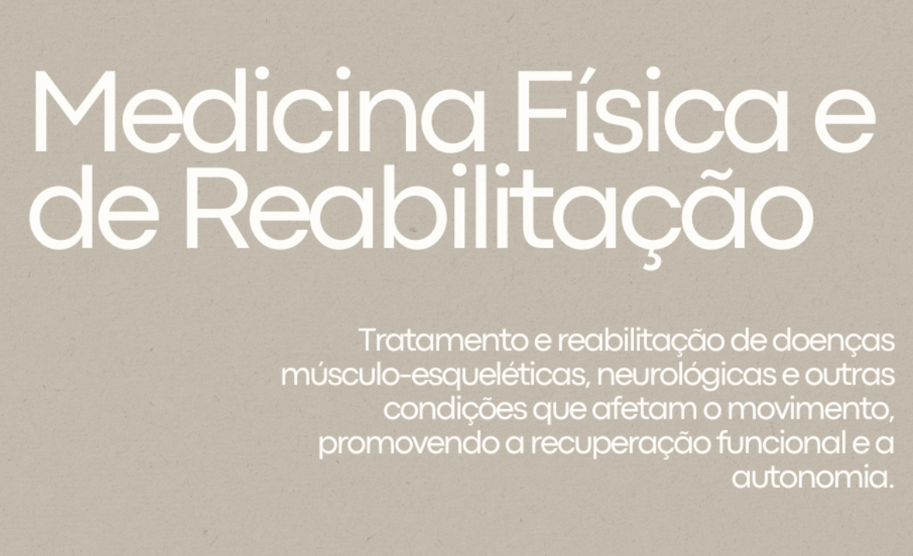

# Reference — Services Carousel

**Format:** Instagram carousel, 8 slides, 4:5 portrait
**Function:** Introduces the clinic's full set of medical specialties.

## Caption

> Cada pessoa é única, e cada cuidado também.
> Por isso, reunimos especialidades que se complementam para promover equilíbrio, força e bem-estar.

## Source assets

The 8 slides as published. Files live in [`./2026-04-30-services/`](./2026-04-30-services/).

| # | Slide |
|---|---|
| 1 |  |
| 2 |  |
| 3 |  |
| 4 |  |
| 5 |  |
| 6 |  |
| 7 |  |
| 8 |  |

## Slide transcript

| # | Headline | Body |
|---|---|---|
| 1 | Medicina Geral e Familiar | Cuidados médicos contínuos, focados na prevenção, diagnóstico e tratamento de doenças em todas as fases da vida. |
| 2 | Medicina Desportiva | Avaliação e acompanhamento de atletas e praticantes de atividade física, com foco na prevenção de lesões, otimização do desempenho e recuperação funcional. |
| 3 | Consulta de Cessação Tabágica | Apoio médico personalizado para deixar de fumar, com estratégias adaptadas a cada pessoa, ajudando na redução dos sintomas de abstinência e no controlo da dependência. |
| 4 | Treino Personalizado | Sessões de exercício físico orientadas por profissionais qualificados, ajustadas às necessidades e objetivos individuais, para melhorar a condição física e a saúde geral. |
| 5 | Medicina Física e de Reabilitação | Tratamento e reabilitação de doenças músculo-esqueléticas, neurológicas e outras condições que afetam o movimento, promovendo a recuperação funcional e a autonomia. |
| 6 | Consultas ao domicílio | Serviço médico de proximidade, prestado no conforto da sua casa, para situações que exigem avaliação ou acompanhamento sem deslocação à clínica. |
| 7 | Nutricionista | Avaliação e orientação alimentar personalizada, com planos nutricionais ajustados aos objetivos de saúde, bem-estar e estilo de vida. |
| 8 | Consulta pré e pós-parto, amamentação e laserterapia mamilar | Acompanhamento clínico especializado para mães em fase pré e pós-parto, com apoio à amamentação e tratamento com laserterapia para o alívio de desconfortos mamilares e promoção da cicatrização. |

## What this carousel established for the system

This was the first carousel analyzed. Most of the foundations doc derives from it:

- The **two-color, single-texture, two-typeface** rule.
- The **service-slide layout** (`templates/instagram-multi-service-slide.md`).
- The **Portuguese-Portugal voice** with its noun-led, promise-then-mechanism sentence shape.
- The **service taxonomy** — confirms a multi-disciplinary clinic, not a solo practice. Eight distinct services span generalist medicine, sports, rehab, nutrition, smoking cessation, home visits, and maternal care.

## Notable patterns across the 8 slides

- **Service ordering** is generalist → specialist → lifestyle → home/maternal. Not alphabetical, not by frequency. The first slide is the broadest service (Medicina Geral); the last is the most specialized (lasterapia mamilar). Worth checking whether this ordering rule holds in future carousels.
- **Headline length varies wildly** — from one word ("Nutricionista") to a full clause ("Consulta pré e pós-parto, amamentação e laserterapia mamilar"). The layout absorbs both without breaking. Long headlines compress the body column; short headlines give it more breathing room.
- **Every slide ends with the arrow pill**, including slide 8. There's no terminal "swipe-up to book" or contact slide in this carousel — it ends on a service.

## Open questions raised by this carousel

- There's no cover/title slide — slide 1 jumps straight into the first service. Is this deliberate, or does this brand sometimes use a cover slide?
- There's no closing CTA slide — no phone number, no booking link, no Instagram handle. How does the brand drive conversion off Instagram? (Bio link only?)
- The carousel doesn't list every team member or doctor associated with each service. Is there a separate "team" carousel format, or does the brand keep practitioners anonymous in service comms?
